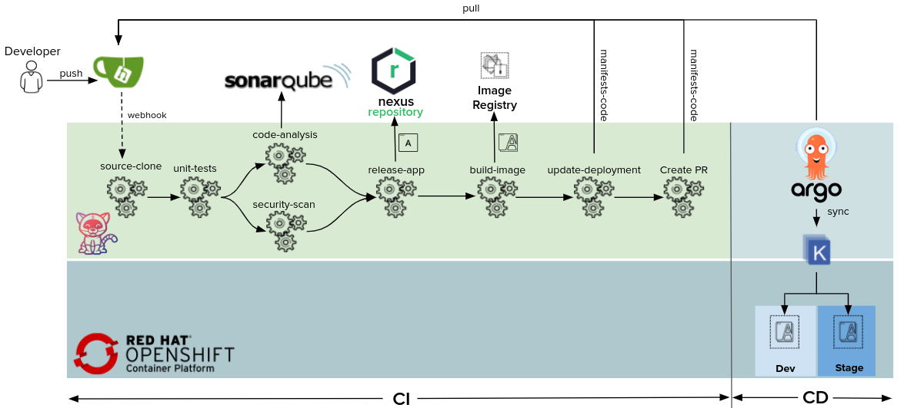
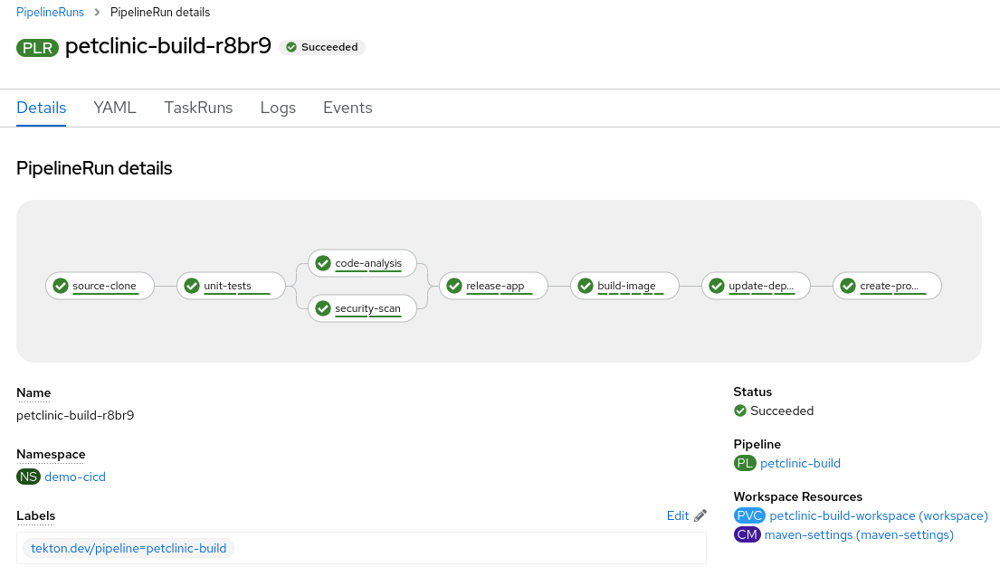
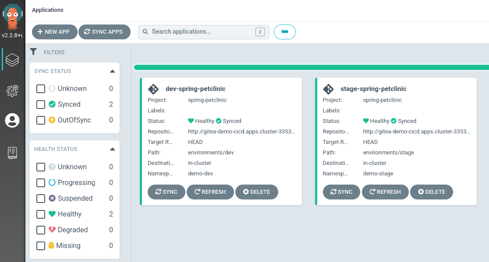

= CI/CD Demo with Tekton and Argo CD on OpenShift

This repo is a CI/CD demo using http://www.tekton.dev[Tekton Pipelines] for continuous integration and https://argoproj.github.io/argo-cd/[Argo CD] for continuous delivery on OpenShift which builds and deploys the https://github.com/spring-projects/springpetclinic[Spring PetClinic] sample Spring Boot application. This demo creates:

* 3 namespaces for CI/CD, DEV and PROD projects
* 1 Tekton pipeline for building the application image on every Git commit
* Argo CD (login with OpenShift credentials)
* Gitea git server (username/password: `gitea`/`openshift`)
* Sonatype Nexus (username/password: `admin`/`admin123`)
* SonarQube (username/password: `admin`/`admin`)
* Git webhooks for triggering the CI pipeline



== Prerequisites

* OpenShift Pipelines 1.6
* OpenShift GitOps 1.4

== Continuous Integration

On every push to the `spring-petclinic` git repository on Gitea git server, the following steps are executed within the Tekton pipeline:

1. Code is cloned from Gitea git server and the unit-tests are run
1. Unit tests are executed and in parallel the code is analyzed by SonarQube for anti-patterns, and a dependency report is generated
1. Application is packaged as a JAR and released to Sonatype Nexus snapshot repository
1. A container image is built in DEV environment using S2I, and pushed to OpenShift internal registry, and tagged with `spring-petclinic:[branch]-[commit-sha]` and `spring-petclinic:latest`
1. Kubernetes manifests are updated in the Git repository with the image digest that was built within the pipeline
1. A pull-requested is created on config repo for merging the image digest update into the STAGE environment

== Continuous Delivery

Argo CD continuously monitor the configurations stored in the Git repository and uses https://kustomize.io/[Kustomize] to overlay environment specific configurations when deploying the application to DEV and STAGE environments.

== Deploy

. Get an OpenShift cluster up and running
. Install OpenShift Pipelines Operator

```sh
$ oc apply --kustomize github.com/cmcornejocrespo/openshift-pipelines-kustomization/openshift-pipelines-operator/base?ref=myauto
```
[start=3]
. Install OpenShift GitOps Operator

```sh
$ oc apply --kustomize github.com/cmcornejocrespo/openshift-gitops-kustomization/gitops-operator/base?ref=myauto
```

[start=4]
. Download https://mirror.openshift.com/pub/openshift-v4/clients/ocp/latest/[OpenShift CLI] and https://github.com/tektoncd/cli/releases[Tekton CLI]

[start=5]
. Deploy the demo

```sh
$ git clone https://github.com/cmcornejocrespo/openshift-cicd-demo
$ demo.sh install
```
[start=6]
. Start the deploy pipeline by making a change in the `spring-petclinic` Git repository on Gitea, or run the following:

[start=7]
```sh
$ demo.sh start
```
[start=8]
. Check pipeline run logs

```sh
$ tkn pipeline logs petclinic-build -L -f -n demo-cicd
```





== Demo Instructions

. Go to spring-petclinic Git repository in Gitea
. Log into Gitea with username/password: `gitea`/`openshift`
. Edit a file in the repository and commit to trigger the pipeline
. Check the pipeline run logs in Dev Console or Tekton CLI:

```sh
$ tkn pipeline logs petclinic-build -L -f -n demo-cicd
```
[start=5]
. Once the pipeline finishes successfully, the image reference in the `spring-petclinic-config/environments/dev` are updated with the new image digest and automatically deployed to the DEV environment by Argo CD. If Argo CD hasn't polled the Git repo for changes yet, click on the "Refresh" button on the Argo CD application.

. Login into Argo CD dashboard and check the sync history of `dev-spring-petclinic` application to verify the recent deployment

. Go to the pull requests tab on `spring-petclinic-config` Git repository in Gitea and merge the pull-requested that is generated for promotion from DEV to STAGE

image:docs/images/promote-pr.png[Promotion Pull-Request]

[start=8]
. Check the sync history of `stage-spring-petclinic` application in Argo CD dashboard to verify the recent deployment to the staging environment. If Argo CD hasn't polled the Git repo for changes yet, click on the "Refresh" button on the Argo CD application.